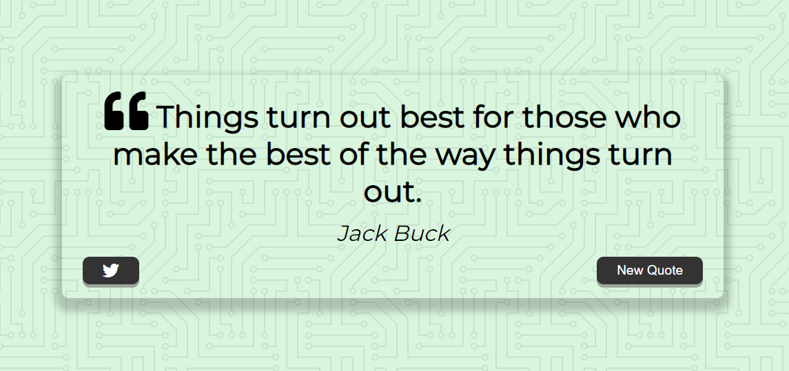

# Quote Generator App

This is a solution Simple quote generator app bulid as a part of ZTM javascript course. 

## Table of contents

- [Overview](#overview)
  - [The challenge](#the-challenge)
  - [Screenshot](#screenshot)
  - [Links](#links)
- [My process](#my-process)
  - [Built with](#built-with)
  - [What I learned](#what-i-learned)
  - [Continued development](#continued-development)
  - [Useful resources](#useful-resources)

## Overview

### The Project

A simple quote generator app build with vanila JS, applying basic DOM manipulatons and fetch API,

### Screenshot



### Links

- Code : (https://github.com/Kaushaljoshi29/ztm-quoteGenerator) 
- Live: (https://your-live-site-url.com)

## My process

### Built with

- Semantic HTML5 markup
- CSS custom properties
- Flexbox
- Desktop-first workflow
- Fetch API

### What I learned

Learned how to use fetch() method making a request and fetching a resource

```js
sync function getQuotes() {
  showLoading();
  const apiUrl = "https://type.fit/api/quotes";

  try {
    const response = await fetch(apiUrl);
    apiQuotes = await response.json();
    newQuote();
  } catch (error) {
    alert(error);
    //Catch Error Here
  }
}
```

### Continued development

Will continue to explore more open source APIs

### Useful resources

- [Learn JavaScript Promises and Async/Await ](https://www.freecodecamp.org/news/learn-promise-async-await-in-20-minutes/).

